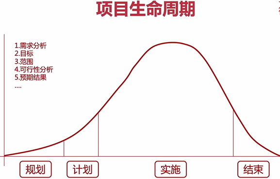

# 阶段一：开启大前端的大门

## 第1周 认识大前端，开启无限可能

 万丈高楼平地起。开课第一周，我们将以轻松幽默的方式，从实际工作中的开发痛点出发，以项目全生命周期为主线，对全栈有全局的认识。从整体项目分析开始，培养您的项目架构思维。
​ 课程安排：

### 1. 了解大前端知识体系，让您有全局的认知

具体功能和技术栈：

**界面：**

**后台：**

**小程序：**

**前端基础：**

1. 有扎实的 Javascript（ES6）/HTML/CSS前端功底
2. 有 Node js、Vue基础，并开发过Demo项目
3. 不少于1年的Web前端开发经验

理解大前端的定义，让您不再迷茫。

### 3. 项目规划及DevOps流程

1. 项目定义阶段（了解）

   1. 没有明确项目的目标、资源、工期
   2. 没有进行合理的评估与预算
   3. 客户沟通不及时、不充分、不具体

2. 项目需求分析阶段（了解）

   1. 详细的需求分析，项目预算
   2. 资源计划与合理的分工
   3. 客户沟通不及时、不充分、不具体

3. **项目开发阶段（重点）**

   

4. 项目收尾（了解）

   1. 没有规范的收尾流程，草草结束
   2. 没有对文档进行归档，对项目进行总结，形成组织资产
   3. 资源回收不及时，造成资源浪费

5. 解决方案

   1. 对组织人员培训，转变思维向自动化/规范化转型
   2. 配合效率工具（自动化）对流程进行简化/标准化
   3. 全员参与并实践

6. **Devops内容介绍（重点）**

   1. 敏捷流程

      

   2. 整体开发流程

      

### 4. 分析实际工作中遇到的痛点以及解决办法

1. 如何快速提升？
   1. 入门级学习方法
      - 兴趣
      - 量变到质变：从基础开始，从简单的开始：菜鸟教程；技术需要沉淀
      - 总结和分享

### 5. 掌握需求分析的要点及工具（墨刀/Axure）

### 6. 从原型设计、接口设计到技术栈的宏观项目架构思维。

## 第2周 企业标准的开发环境搭建

 工欲善其事，必先利其器。学习最火的Docker容器技术，快速搭建测试环境。深入讲解前端必会的Mock接口与工具，并专门设计了调试技巧&真机调试讲解，与实际工作开发完美契合。
​ 课程安排：
### 1. 虚拟机搭建与使用
### 2. Linux开发环境及常见命令使用
### 3. 容器技术Docker以及安装及使用
### 4. Node及npm命令的使用
### 5. 搭建DOClever接口测试平台
### 6. 前后端分离开发--RESTful接口及Mock数据
### 7. 常见IDE使用及VSCode的调试配置及默认设置
### 8. 三类真机调试技巧

## 第3周 必会的前端工程化工具

 效率是检验工程师的重要指标之一，如何提高开发效率，从前端工程化工具着手。本周学习实际工作中两大利器Webpack与Gulp，并使用Yeoman搭建自己的脚手架工具，让自己和团队的开发效率翻倍。
​ 课程安排：
### 1. 了解工程化工具的使用场景及具体应用
### 2. 理解Webpack的核心概念，配置Webpack
### 3. 掌握Webpack中的Plugin及Loader的使用
### 4. 了解Gulp的核心概念，学习配置Gulp基础任务
### 5. 配置Yeoman脚手架工程项目
### 6. 创建自己的脚手架工具

## 第4周 深入理解Vue 框架知识

 跟上企业需求的步伐，本周从MVVM框架基础讲起，让您拥有组件化思想，掌握目前流行的Vue框架进阶应用。重点不仅在于应用，也在于原理，做到知其然，知其所以然。
​ 课程安排：
### 1. 了解MVVM框架理念
### 2. 理解组件化思想
### 3. Vue基础、路由及状态管理
### 4. Vue cli工具的使用，创建工程化项目
### 5. Vue CLI命令vue create及项目配置
### 6. Vue CLI命令扩展使用vue ui
### 7. Vue、Vue-router、Vuex综合应用

# 阶段二：抓住团队协作的密码

## 第5周 前端框架分类及选型

 是否还在为选择使用什么框架而苦恼？是否还在为学习哪个前端框架而纠结？本周将给您满意的答案，有UI和JS框架对比与选型，有Node.js进阶使用、Web框架如何开发RESTful接口等。
 课程安排：

### 1. 常见MVVM与UI框架对比与选型
### 2. Koa框架后台项目的配置及ES6语法支持
### 3. Koa工作原理及常见Koa中间件使用
### 4. 登录模块的需求分析及流程设计
### 5. 登录模块的开发，LayUI框架集成
### 6. 邮件服务和图片验证码服务的开发
### 7. 表单验证Vuelidate/VeeValidate
### 8. 配置邮件服务NodeMailer
### 9. 邮件服务接口与找回密码对接
### 10. 如何调试Node应用及webpack配置

## 第6周 团队协作-文档与版本管理

项目开发过程中，少不了团队协作，那团队协作有哪些可以提升效率？团队协作第一弹：从文档管理、版本控制开始，我们了解Git flow和文档的管理办法，搭建团队的文档管理工具，提升工作效率。
课程安排：

### 1. Markdown语法及进阶图表使用
### 2. ShowDoc进行云笔记及文档管理
### 3. 搭建自己团队的接口管理平台
### 4. 学会使用hexo+github搭建自己的博客
### 5. 掌握Git基础命令
### 6. 从零配置github到SSH秘钥克隆仓库
### 7. Git Flow及管理版本控制
### 8. 使用Docker快速搭建gitlab平台
### 9. gitlab平台管理，用户权限控制

## 第7周 团队协作-缺陷控制与自动化流程

项目质量决定了项目的命运，如何做好缺陷控制，是每个团队非常头疼的问题。本周学习团队协作第二弹：缺陷控制及前端自动化流程，使用容器技术配置自动化/持续集成环境，进一步提升团队效率。
课程安排：

### 1. 了解缺陷控制方法
### 2. 掌握缺陷控制工具及使用
### 3. 了解质量管理工作流
### 4. 理解自动化/持续集成流程，升华DevOps理解
### 5. 学习搭建、配置Jenkins服务
### 6. 掌握Jenkins中的权限控制，并与gitlab进行集成
### 7. 学习Jenkins的权限控制与插件管理系统

## 第8周 团队协作-配置前后端自动化任务。

Docker仓库的进阶使用，搭建私有Docker仓库，并配置Jenkins的前后端自动化流程，感受自动化构建的魅力。
课程安排：

### 1. 掌握容器技术Docker进阶使用
### 2. 快速搭建Jenkins平台
### 3. 私有化容器平台Harbor搭建及使用
### 4. 运用Jenkins任务配置，自动化流程
### 5. 自定义Shell脚本
### 6. 配合Jenkins效率构建，完成发布、构建等工作

# 阶段三：打通全栈开发技能

## 第9周 NoSQL数据库的设计与集成（MongoDB/Redis）

 本周带您解开数据之谜，学习NoSQL数据库与数据库设计原则。让您带着设计思维去设计项目数据库，搞定Redis服务搭建与集成，完成具备鉴权功能的登录页面后端开发，综合应用Koa中间件。
 课程安排：

### 1. 了解NoSQL数据库分类及选型
### 2. 掌握数据库设计原则
### 3. 掌握从功能到数据库的基本设计
### 4. 常见MongoDB及Redis与nodejs集成
### 5. 使用Docker快速搭建MongoDB及Redis开发测试环境
### 6. 登录鉴权机制及koa进阶
### 7. JWT方式鉴权接口开发

## 第10周 全栈开发-首页与发帖模块开发

 本周综合前面的知识进行实战，从前端到数据库、接口设计再到组件拆分，最后核心功能实现，进一步加深Vue-router、Vuex进阶应用，实现前&后端全栈页面开发。
 课程安排：

### 1. 掌握首页数据库设计、接口设计、文档更新
### 2. 首页列表、筛选、排序功能开发
### 3. 首页侧栏开发：统计、签到、周热议
### 4. 发帖编辑器自定义开发
### 5. 图片上传功能
### 6. 发帖功能：插入链接|图片、引用|代码样式、预览
### 7. MongDB多表联合查询及统计SQL
### 8. 发贴权限效验

## 第11周 全栈开发-用户中心模块

继续进行核心模块开发，本周将会开发PC用户中心模块，从数据库与接口设计，到消息中心、我的主页、帖子、收藏、用户信息等功能开发，用实战去检验学习效果。
课程安排：

### 1. 设计中心路由及页面跳转
### 2. 头像上传、密码修改、邮箱激活
### 3. 实战“我”发表的帖子列表
### 4. 收藏功能开发；收藏的帖子列表
### 5. 签到功能开发；会员信息、快捷链接
### 6. 搭建WebSocket服务，实时显示用户消息提醒

## 第12周 性能优化-服务端渲染

 性能是评判项目好坏标准之一，本周将带着大家进入性能优化环节，学习配置服务器端渲染思想及Nuxt.js使用，并对前面项目进行改造，让项目的性能更优。
 课程安排：

### 1. 了解SEO优化方法
### 2. 前端性能优化思想
### 3. 前端性能优化之服务端渲染
### 4. Nuxt
### 5. 改造前端项目的功能模块

# 阶段四：前后端分离的后台管理系统

## 第13周 后台管理系统-发帖管理开发

 本周开始进入后台管理系统开发，第一步：从需求分析、界面设计、接口设计、数据库设计，到发帖管理功能模块开发，及发帖管理接口对接，让项目开始具备完善的管理系统。
 课程安排：

### 1. 技术框架选型及UI框架选型
### 2. 后端需求分析，接口设计，数据库设计
### 3. iView-admin框架集成
### 4. 解析项目架构，添加路由和菜单
### 5. 定制开发登录入口，加入JWT鉴权机制
### 6. Cookie及Session的使用方式
### 7. 实战多语言场景：英文&简体中文

## 第14周 后台管理系统-文章与用户管理开发

 本周进行后台管理系统开发第二步：从需求分析、接口与数据库设计，到文章与用户管理两大重要功能模块开发，与Node的后台进行接口对接，轻松实现文章和用户管理，系统功能进一步升级。
 课程安排：

### 1. 使用ShowDoc定义接口文档
### 2. 使用DOClever开发测试接口
### 3. 设计初步的数据结构，返回的数据类型及Mock数据
### 4. 文章管理、角色管理界面的模态框、页面样式开发
### 5. Node

## 第15周 后台管理系统—首页管理与日志服务开发

继续学习，后台管理系统开发第三步：完成后端管理平台的首页管理，对首页统计功能进行定制开发，并增加日志服务，对后台接口的调用增加日志管理，实现系统功能完善与监管。
课程安排：

### 1. 用户权限设计
### 2. 首页管理定制接口、数据库设计
### 3. 实现日志服务的配置与定制化
### 4. 后端首页的可视化解决方案
### 5. 图表设计及数据接口开发

## 第16周 前后端联调必备通用技能

只停留在开发还远远不够，如何进行前后端联调，并正常运行很重要。本周学习前后端联调及细节优化，定制Jenkins任务及配置前后端自动化任务。并学习移动端应用开发的痛点问题及开发基础。
课程安排：

### 1. 掌握前后端联调技能
### 2. Jenkins配置前后端项目的自动化
### 3. 项目运行维护阶段的注意事项
### 4. 版本控制及迭代升级流程
### 5. WebApp原型设计及工具使用
### 6. WebApp开发基础：布局、适配、性能优化等
### 7. WebApp开发的常见问题

# 阶段五：流行的WebApp与小程序开发

## 第17周 WebApp页面设计与开发。

 随着终端设备的发展，在移动端浏览Web已成主流。本周继续进行WebApp功能模块开发：登录页面、首页及个人中心开发，学习了解消息机制，移动端消息开发。
 课程安排：

### 1. 原型工具页面设计
### 2. 移动端如何进行适配
### 3. 开发登录、注册、密码找回页面
### 4. 首页、个人中心开发
### 5. 发帖、消息页面开发

## 第18周 WebApp前后端联调。

 WebApp页面开发只是第一步，如何和后端对接，掌握从后台管理到前端展现的整体解决方案，提升技能和解决实际问题的能力更为重要。
 课程安排：

### 1. 与后端接口进行对接
### 2. 上拉加载、下拉刷新的开发技巧
### 3. 消息功能设计技巧
### 4. WebSocket服务搭建及使用
### 5. 个人中心对接功能实战

## 第19周 小程序基础

 本周介绍小程序的开发适用场景，实操小程序的注册流程，掌握开发中的注意事项、学习小程序原生框架基本用法，快应用开发框架的使用，并且能够独立调试开发小程序。
 课程安排：

### 1. 了解小程序注册流程
### 2. 了解小程序注册方式及注册主体
### 3. 了解跨端框架适用场景及开发工作流
### 4. 掌握小程序开发环境配置
### 5. 掌握小程序本地化调试办法
### 6. 掌握快应用场景：mpvue/wepy基础

## 第20周 小程序进阶

 学习如何配置小程序、小程序的生命周期，以及如何使用第三方的组件库，提升小程序的应用能力。
 课程安排：

### 1. 掌握小程序面板配置，如何配置app
### 2. 了解小程序的生命周期
### 3. 多页面下的开发工作流及目录结构
### 4. 使用npm第三方依赖包
### 5. 常见的API接口（HTTP请求、缓存）
### 6. 上拉加载、下拉刷新如何使用及使用场景

## 第21周 小程序-首页、登录、菜单定制开发

 小程序开发实战第一部分，学习首页的列表开发、菜单定制的开发、微信接口及数据库的设计。
 课程安排：

### 1. 了解wepy/mpvue框架基础
### 2. 了解小程序工程化项目
### 3. 掌握小程序常用组件（轮播、卡片、导航）
### 4. 掌握小程序后台管理界面和设置
### 5. 掌握开发基础及版本管理
### 6. 前后端接口对接HTTPS设置
### 7. 业务模块的开发：首页、菜单、登录

## 第22周 小程序-详情、编辑与发帖、个人中心开发

 小程序开发实战第二部分，学习个人中心、详情页面、编辑发帖等业务模块的功能开发，以及如何与后台接口进行对接，完成页面的整体功能调试。
 课程安排：

### 1. 小程序页面设计思想
### 2. 小程序自定义组件
### 3. WebSocket服务搭建
### 4. 消息功能的接口设计
### 5. 掌握消息机制
### 6. 详情、个人中心模块开发
### 7. 编辑与发帖模块开发

## 第23周 项目部署与运维

 介绍云服务器、域名及HTTPS服务、项目运维及Linux相关自启脚本介绍、项目更新及日志处理、如何发送报警通知及应急策略的制定。
 课程安排：

### 1. 如何进行服务器监控、服务器日志及报警
### 2. 理解域名服务及HTTPS
### 3. 了解购买云服务器及管理
### 4. 能编写基本的运维脚本
### 5. 能项目运行维护/更新终止
### 6. 了解项目总结及资源回收
### 7. 如何进行项目重构

## 第24周 全面汇总与未来展望

 课程整体重要知识点回顾，全周期流程回顾，以及未来技术展望，如TypeScript进行项目重构与vue3.x进行兼容对接；混合应用框架；跨端应用框架；桌面应用Electron等，做好未来发展指引。
 课程安排：

### 1. 重点知识回顾
### 2. 开发流程回顾
### 3. 趋势技术的介绍与指引
### 4. 面试中的技巧总结

